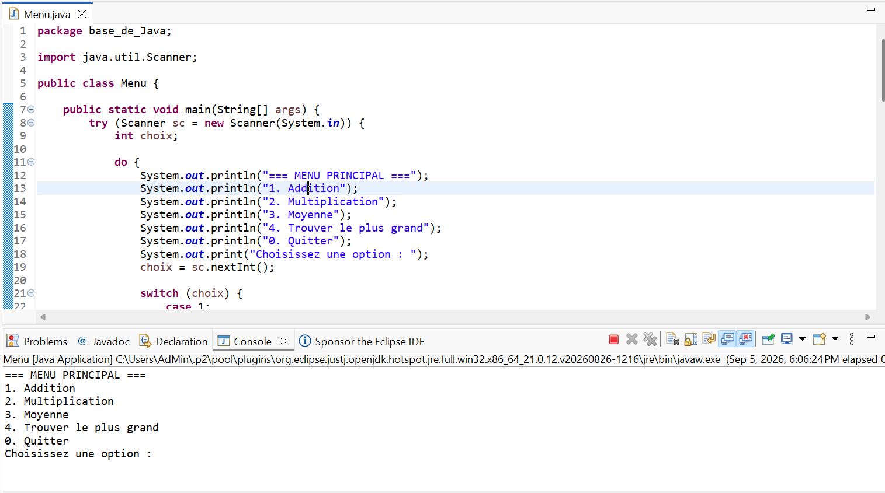
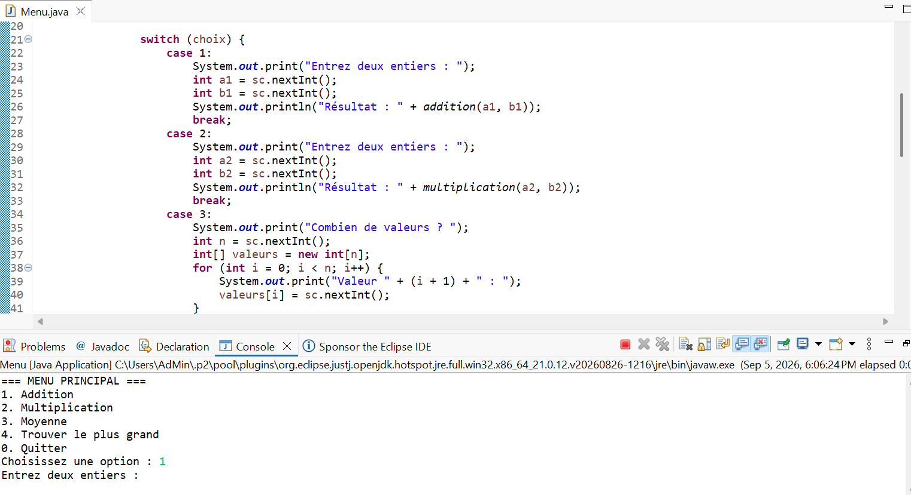
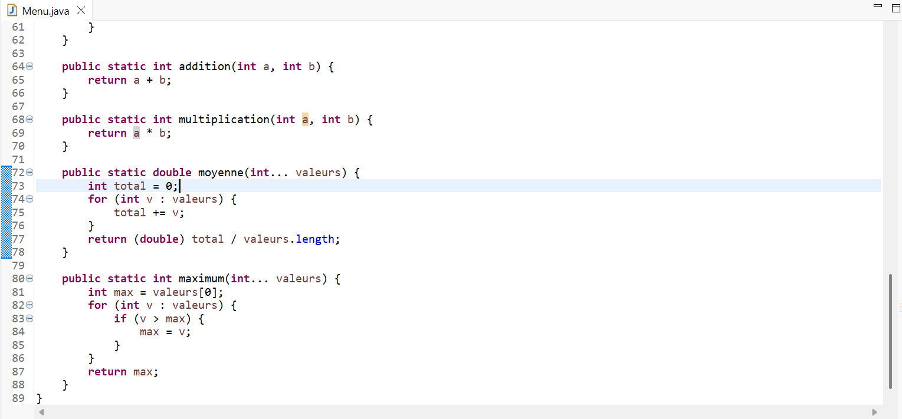
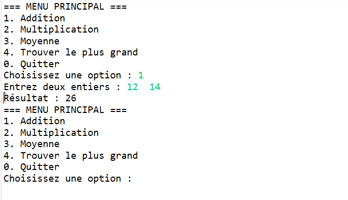
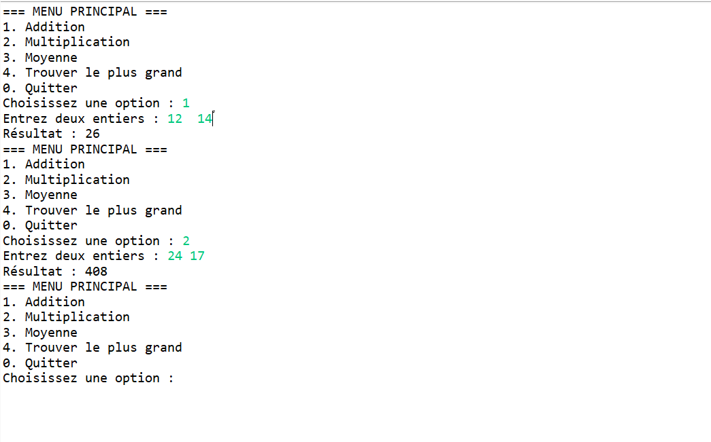

# Menu - TP Java

Programme console en Java qui affiche un menu interactif permettant à l'utilisateur d'effectuer plusieurs opérations mathématiques : addition, multiplication, calcul de moyenne et recherche du plus grand nombre.

## Objectifs

- Afficher un menu principal avec plusieurs options
- Lire une saisie utilisateur au clavier avec `Scanner`
- Structurer le code en méthodes réutilisables
- Utiliser les arguments variables (`int...`) pour des méthodes flexibles (`moyenne`, `maximum`)
- Mettre en place une boucle `do-while` et une structure `switch` pour diriger le programme

## Prérequis

- JDK installé (version 8 ou supérieure)
- Un IDE (IntelliJ, Eclipse, VS Code) ou simplement un terminal avec `javac` et `java`

## Compilation et exécution

```bash
javac Menu.java
java Menu
```

## Étape 1 : Affichage du menu principal

Le programme affiche un menu avec 5 options : addition, multiplication, moyenne, recherche du plus grand, et quitter.

```
=== MENU PRINCIPAL ===
1. Addition
2. Multiplication
3. Moyenne
4. Trouver le plus grand
0. Quitter
Choisissez une option :
```

Capture d'écran : menu affiché au lancement du programme



## Étape 2 : Lecture du choix de l'utilisateur

Un objet `Scanner` lit le choix saisi par l'utilisateur. Cette lecture est placée dans une boucle `do-while`, qui garantit que le menu s'affiche au moins une fois et se répète tant que l'utilisateur ne saisit pas 0.

```java
Scanner sc = new Scanner(System.in);
int choix;
do {
    System.out.print("Choisissez une option : ");
    choix = sc.nextInt();
    // Appel de la méthode correspondante
} while (choix != 0);
```

Capture d'écran : saisie d'un choix (par exemple 1) dans la console



## Étape 3 : Méthodes de calcul

Chaque opération est encapsulée dans sa propre méthode, ce qui rend le code plus clair et réutilisable.

```java
public static int addition(int a, int b) {
    return a + b;
}

public static int multiplication(int a, int b) {
    return a * b;
}

public static double moyenne(int... valeurs) {
    int total = 0;
    for (int v : valeurs) {
        total += v;
    }
    return (double) total / valeurs.length;
}

public static int maximum(int... valeurs) {
    int max = valeurs[0];
    for (int v : valeurs) {
        if (v > max) {
            max = v;
        }
    }
    return max;
}
```

Capture d'écran : code source des méthodes dans l'IDE



## Étape 4 : Intégration dans le menu (switch)

Le `switch` relie chaque option du menu à la méthode correspondante, lit les valeurs nécessaires, puis affiche le résultat.

```java
switch (choix) {
    case 1:
        System.out.print("Entrez deux entiers : ");
        int a1 = sc.nextInt();
        int b1 = sc.nextInt();
        System.out.println("Résultat : " + addition(a1, b1));
        break;

    case 2:
        System.out.print("Entrez deux entiers : ");
        int a2 = sc.nextInt();
        int b2 = sc.nextInt();
        System.out.println("Résultat : " + multiplication(a2, b2));
        break;

    case 3:
        System.out.print("Combien de valeurs ? ");
        int n = sc.nextInt();
        int[] valeurs = new int[n];
        for (int i = 0; i < n; i++) {
            System.out.print("Valeur " + (i + 1) + " : ");
            valeurs[i] = sc.nextInt();
        }
        System.out.println("Moyenne : " + moyenne(valeurs));
        break;

    case 4:
        System.out.print("Combien de nombres ? ");
        int m = sc.nextInt();
        int[] entiers = new int[m];
        for (int i = 0; i < m; i++) {
            System.out.print("Nombre " + (i + 1) + " : ");
            entiers[i] = sc.nextInt();
        }
        System.out.println("Maximum : " + maximum(entiers));
        break;

    case 0:
        System.out.println("Fin du programme.");
        break;

    default:
        System.out.println("Option invalide !");
}
```

Capture d'écran : exécution d'un calcul complet (choix 1, saisie de deux entiers, résultat affiché)



## Exemple d'exécution complète

```
=== MENU PRINCIPAL ===
1. Addition
2. Multiplication
3. Moyenne
4. Trouver le plus grand
0. Quitter
Choisissez une option : 1
Entrez deux entiers : 10 20
Résultat : 30
=== MENU PRINCIPAL ===
...
Choisissez une option : 0
Fin du programme.
```

Capture d'écran : scénario complet du menu jusqu'à la sortie



## Structure du projet

```
├── Menu.java
├── README.md
└── captures/
    ├── 1.png
    ├── 2.png
    ├── 3.png
    ├── 4.png
    └── 5.png
```

## Concepts mobilisés

- Contrôle de flux (`switch`, `do-while`)
- Manipulation du clavier avec `Scanner`
- Conception de méthodes réutilisables
- Calculs simples et fonctions avec arguments variables (`int...`)

## Auteur

Soufiane — TP Java, Master DSIE, ENS Marrakech
